#                                产测软件调试总结

# 一、通用注意事项
​    
| ID   | 工站 |
|  ----  | ----  |
| 1  | 电流 |
| 2  | 内参 |
```C++
 typedef enum
{
    VzExposureControlMode_Auto = 0,
    VzExposureControlMode_Manual = 1,
}VzExposureControlMode;
 ```
- 产测软件存放目录不能有中文字符
- 扫码枪扫码时，输入法必须为英文输入，否则扫码错误，无法打开相机。
- 测试时注意相机类型及灯的类型和角度，使用对应的测试文件测试。
- 测试成功但写入MES数据库不成功时会有弹窗提醒，如果不注意直接进行下一站测试，软件会报上一站测试未通过。
- 由于网络连接导致发生写入数据库失败时，请重启产测软件。现有设计没有重连数据库的操作。
- 标定过程中一定要将相机前面板上的保护膜去掉，注意不要划伤面板，不要弄脏，有无尘布，每站测试前先用无尘布将镜头面板擦拭干净。

# 二、电流站

## 2.1、操作注意事项
- 串口触发线需要连接标签为560、DS77的串口线。
- 打开图像成功后注意观察图像是否正常，有RGB的，也要看一下RGB图像是否正确。
- 测试电流时需要将相机镜头扣在桌面的黑色绒布上（后期会做专门的工装）。
-  Trigger out 及Trigger In 测试时查看是否正确上图，默认设置上三张图，注意检查图像是否变化。
- Trigger out 或Trigger In测试中如果出现slave相机不出图的现象，先检查打开测试软件时，slave相机的灯是否常亮，如果常亮，需要重新拔插slave相机的电源、网线及串口线，或重启测试电脑。如果以上操作不能排除问题，考虑是工装信号未发出，需要硬件同事帮忙排查。
- 底噪测试需要严格的将相机倒扣到桌面绒布上，并用绒布包严实，后期使用工装测试时也要保证不透光。

## 2.2、软件调试问题

- 因为相机内新加滤波将Trigger In信号过滤掉，需要更改Trigger In触发方式，改为用继电器触发，电流站引入继电器触发相关程序，目前只用channel 3发出触发信号，工装安装时要与软件使用通道相同。如下图所示最右侧为channel 3.

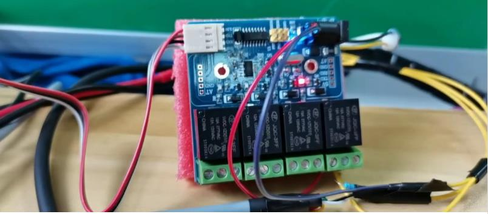

- Trigger In串口号配置，注意只填数字。

```bash
#Trigger In 串口号
TriggerInCom=8
```
- 帧率测试项中添加RGB帧率测试。
- 新加底噪标定规格值检查，底噪标定时请扣严相机，避免有光透过。

```bash
	#底噪标定（Bottom noise）， LDtype为0,1,2,3,4对应的Max Valid Factor
	MaxValidFactorBNList=877 877 877 877 877

	#底噪标定， LDtype为0,1,2,3,4对应的Min Valid Factor
	MinValidFactorBNList=0 0 0 0 0

	#底噪标定，异常占比规格值
	AbnormalRatio=0.002
```
# 三、内参站

## 3.1、操作注意事项

- 配置文件中更新range列表和DepthList配置。

  ```
  	#标定range列表
  	CalibRangeList=0 3 5
  	
  	#7458角度的配置，请检查灯类型及角度
  	CalibMaxDepthList=1249 3123 7495
  	CalibEffectMinDepthList=800 800 800
  	CalibEffectMaxDepthList=1249 3123 4500
  	
  	#6050角度的配置，请检查灯类型及角度
  	#CalibMaxDepthList=1249 3123 7495
  	#CalibEffectMinDepthList=950 950 950
  	#CalibEffectMaxDepthList=1249 3123 4500
  ```

  

- 测试时画面中线与拍摄的标定图像黑线尽量重合，锚点及角点信息尽量多。

​    

- 数据库中存储数据较长，加长数据长度，将第二站内参站及第六站终测(ToF)数据长度由255改为500。

  

- 

  

## 3.2、软件调试问题

- 
  ToF相机与RGB相机参数个数不同，在MES中存储要区分

```
//g_sqldata存储内容：
//IR+RGB 相机：
//Depth内参(9个参数),Depth畸变参数(8个参数),RGB内参(9个参数),RGB畸变参数(8个参数),旋转参数(9个参数),T参数(3个参数)
//onlyIR 相机：
//Depth内参(9个参数),Depth畸变参数(8个参数)
```

# 四、非线性标定

## 4.1、 操作注意事项
- 相机放置到工装里时，相机后面板紧贴工装。同一类型的相机不用每次测量cameraOffset值，确保放入工装位置相同，可以使用同一个值。
-  测试过程中注意中心点是否脱靶。
- 测试过程中避免人员走动及终测站IR平面光源的影响
- 非线性标定成功结束后，复检开始前，一定要将相机断电再上电，使标定参数生效。

## 4.2、软件调试问题
-  将工站名称添加到配置文件，工站显示名称为可配置的。若配置文件里要配置工站名称为中文字符，注意将配置文件的编码格式修改为 UTF-8-BOM。


- 改为3range标定，rangelist配置要与内参站配置相同。

  ```
  rangelist = 0 3 5
  ```

-  配置文件中添加数据库名称db_name配置项，配置为正式数据库的数据库名称。代码中没有修改原有的默认连接的测试数据库。

  ```
  	#数据库名称
  	db_name=VzenseFactoryMES_DB
  ```


# 五、非线性复检

## 5.1、操作注意事项

-  非线性标定结束后，相机位置不需要变动，只需要下电后再重新上电。

-  MES版复检点数配置文件内可配置，可以根据实际需要更改。 现在为检测三个点

  

  


## 5.2、软件调试问题

- 将工站名称添加到配置文件，工站显示名称为可配置的，若配置文件里要配置工站名称为中文字符，注意将配置文件的编码格式修改为 UTF-8-BOM。同非线性标定。

- 配置文件中添加数据库名称db_name配置项，配置为正式数据库的数据库名称。

  ```
  	#数据库名称
  	db_name=VzenseFactoryMES_DB
  ```

  

# 六、平面度

## 6.1、操作注意事项

- 相机按照要求放入工装，待测相机与标定板的距离在860mm左右。
- 测试完成后可以拔插电源后利用GUITool 查看点云图是否平整。

  

## 6.2、软件调试问题

- 配置文件中将曝光时间设置为1毫秒。

  ```
  #曝光时间
  exposureTime=1000
  ```
  
  
  
- 新加FOV参数判断灯的类型是否合规

```
	#FOV检查， LDtype为0,1,2,3,4对应的Max Valid Factor
	MaxValidFactorList=15 64 64 15 25

	#FOV检查， LDtype为0,1,2,3,4对应的Min Valid Factor
	MinValidFactorList=0 0 0 0 0

	#FOV检查，6050 异常占比规格值
	AbnormalRatio=0.03
	#FOV检查，7050异常占比规格值
	#AbnormalRatio=0.001
```

- 新加PlaneTest()接口检查平面度测试结果。

  ```bash
  	#标准差
  	PC_DistanceStd = 3
  	#相机离测试板距离
  	PC_Distance = 860
  	#块均方差
  	PC_MeanBlockMse = 3
  ```

- 遇到存储的bin文件错误问题，如下图所示，右侧为正常的confidence和planeness图，左侧为存储的错误图。Frame类型的数据内部data为指针，注意不要更改源地址数据。

  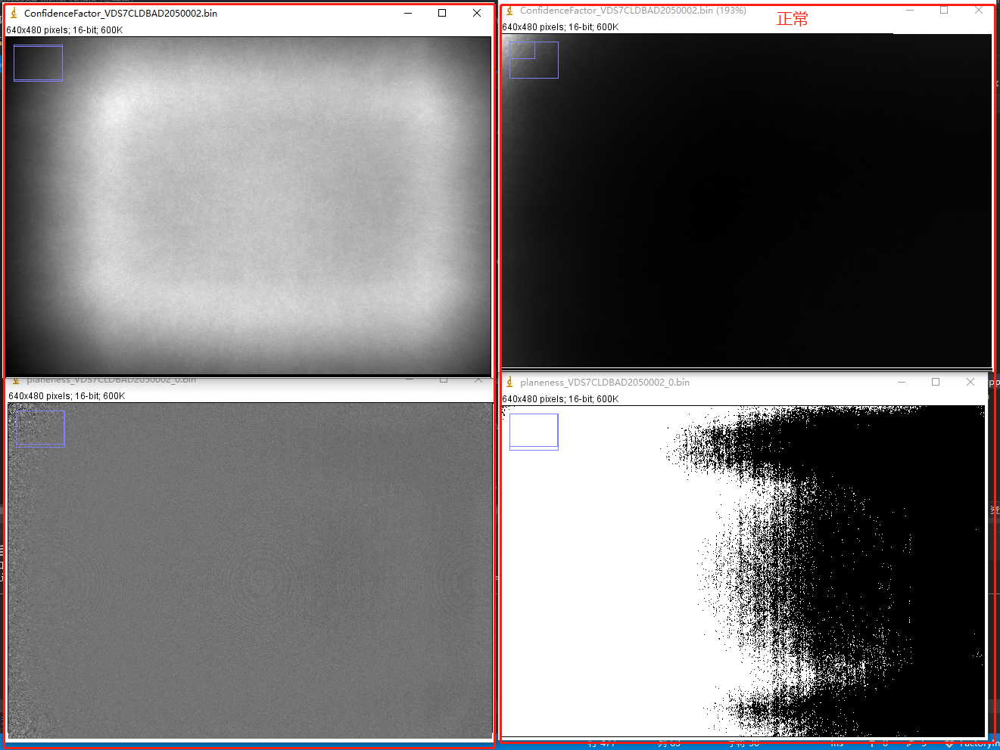

  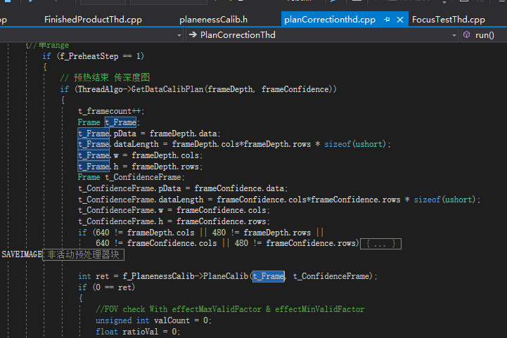

- 平面度传图时confidence图有错乱，是拷贝confidence图时copyTo的调用放到了unlock（）之后，错误图如下

  

  对应代码已修改：

  

# 七、终测（ToF）

## 7.1、操作注意事项

- 按照要求将相机放入工装。
- 针对固件版本DS77_S_20230130_B51，测试时使用的测试图卡为大图卡，与现在调焦站使用的不一样，调焦站使用的为小图卡。

- 配置文件中writeMAC一定要设置为1

  ```
  #是否记录MAC地址
  writeMAC=1
  ```

- 本站需要测试电流，注意将电流表接入相机电源和电脑，并在电脑端配置正确的com口。

- 两个12V恒压调光器(IR平面光源)都需要使用Channel2，如下图所示，按动按钮CH1-2/CH1-4进行切换。切换后的效果如下图：

  恒压调光器.jpg)

  

  


## 7.2、 软件调试问题

-   配置文件中将曝光时间设置为1毫秒。

  ```
  #曝光时间
  exposureTime=1000
  ```

-  电流测试与读MAC数据库冲突，导致电流值拿不到，一直为0，调整读MAC顺序。

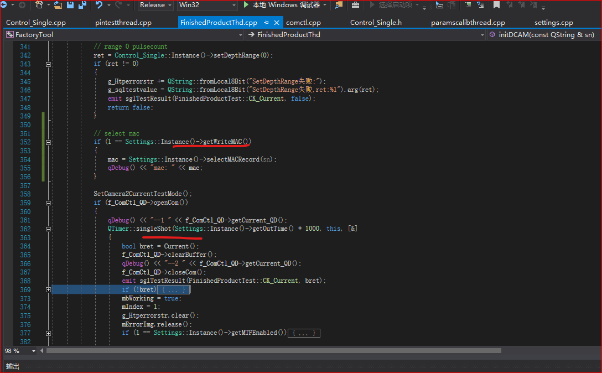

- 上一个相机测试失败，下一个SetDataMode 失败，直接esc退出，再次扫码测试时报读取图像失败。退出时有关键标志位没有恢复为默认，导致下次执行时状态不对了。

  

  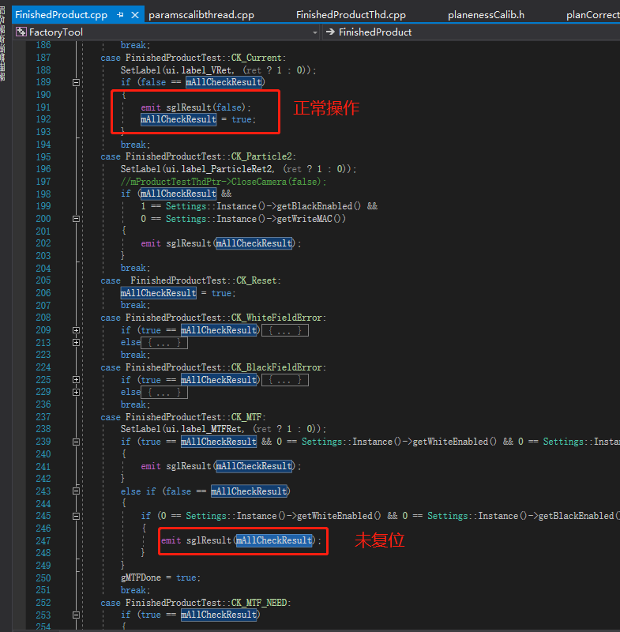

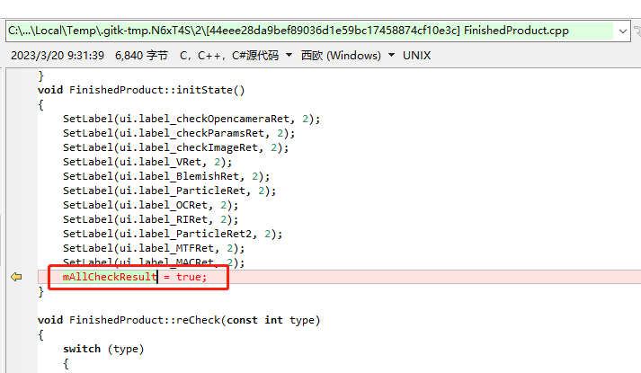


- MTF值跳变，输入MTF算法的图像格式做了两次转换，导致计算出的MTF值不准确。

  

  终测站将原来IRPixelFormat设置为1的代码注释掉了，现在收到的数据格式本来就是CV_8U

  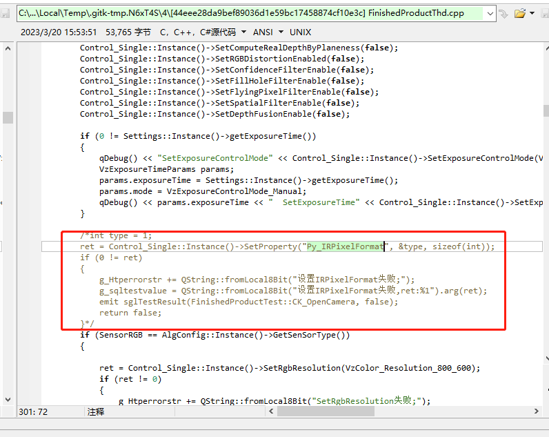

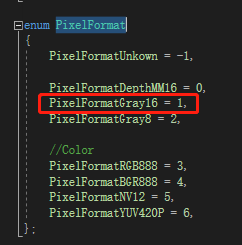

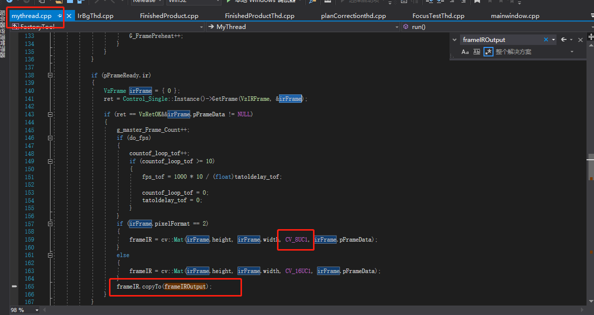

- MTF、白场及黑场测试失败时允许多测试几遍，导致存入数据库的数据有错误冗余，代码中需要去重，将每项测试结果单独存储，最后只存储一次。

  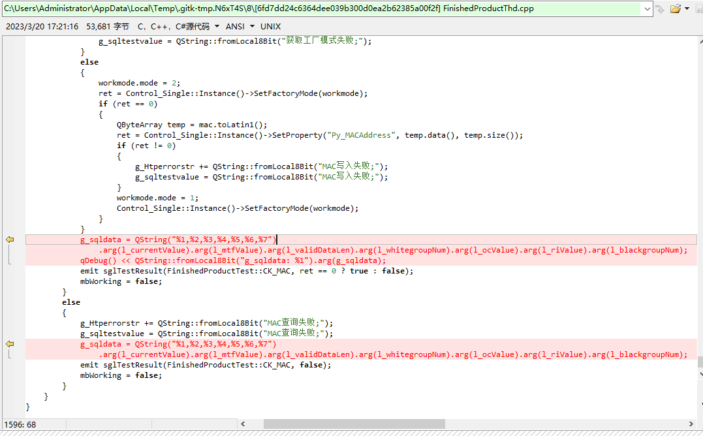

- 两个数据库访问顺序带来的问题，MAC地址存储在数据库VenseMACAddressPool_DB中，数据库VzenseFactoryMES_DB中存储表DS77MESRecord_tbl和DS77TestFailRecord_tbl。向不同数据库中访问或存储数据时要连接相应的数据库。

  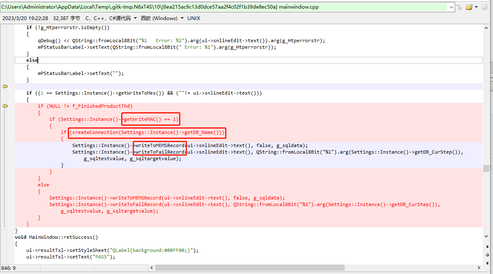


# 八、终测（RGB）站

## 8.1、操作注意事项

- 黑场测试时用无尘布遮挡RGB镜头后，还是有部分光进入镜头，测试会失败，需要用手再遮挡一下。确认画面是全黑的。

- 两个12V恒压调光器都需要使用Channel1。

- VDS77L及VDS77P类型相机不需要本站测试，因为没有RGB镜头。

- 配置文件中writeMAC一定要设置为0，本站不写MAC地址。

  ```
  #是否记录MAC地址
  writeMAC=0
  ```

- 

## 8.2、 软件调试问题

- MTF测试失败后程序崩溃退出

  MTF测试失败时会存储mErrorImg，但终测RGB站并没有向mErrorImg里面存储内容，导致程序崩溃。

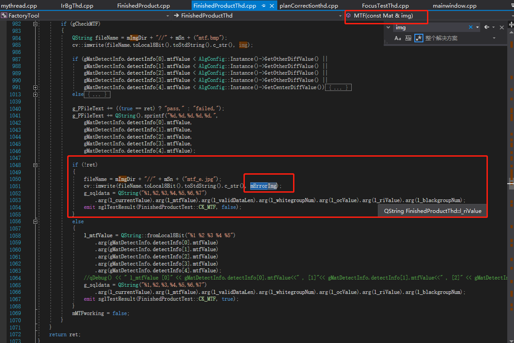

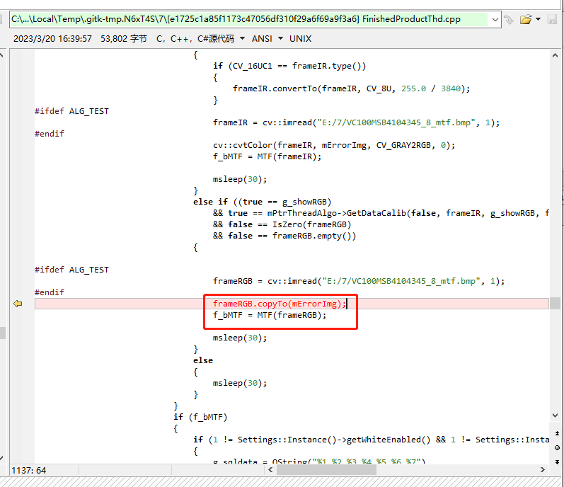

- 同终测（ToF），MTF、白场及黑场测试失败时允许多测试几遍，导致存入数据库的数据有错误冗余，代码中需要去重，将每项测试结果单独存储，最后只存储一次。
