# VZense\_NebulaSDK\_User\_Guide\_Windows\_en

添加图片：


添加代码段：



```cpp
// C++ API code
/**
* @brief         Set the color Gain with the exposure mode of RGB sensor in VzExposureControlMode_Manual.
* @param[in]     device       The handle of the device.
* @param[in]     params       The value of color Gain.Value range: [1.0 15.5]
* @return        ::VzRetOK    if the function succeeded, or one of the error values defined by ::VzReturnStatus.
*/
VZENSE_C_API_EXPORT VzReturnStatus VZ_SetColorGain(VzDeviceHandle device, float params);
```





```csharp
 //C#
 public static void HotPlugStateCallback(ref VzDeviceInfo pInfo, int status, IntPtr contex)
        {
            Console.WriteLine("uri " + status + "  " + pInfo.uri + "    " + (status == 0 ? "add" : "remove"));
            Console.WriteLine("alia " + status + "  " + pInfo.alias + "    " + (status == 0 ? "add" : "remove"));

            if (status == 0)
            {
                Console.WriteLine("VN_OpenDevice " + VNAPI.VN_OpenDeviceByUri(pInfo.uri, ref deviceHandle));
                Console.WriteLine("VN_StartStream " + VNAPI.VN_StartStream(deviceHandle));
            }
            else
            {
                Console.WriteLine("VN_StopStream " + VNAPI.VN_StopStream(deviceHandle));
                Console.WriteLine("VN_CloseDevice " + VNAPI.VN_CloseDevice(ref deviceHandle));
            }
        }
```






```cpp
//C++ API code
/**
* @brief         Set the color Gain with the exposure mode of RGB sensor in VzExposureControlMode_Manual.
* @param[in]     device       The handle of the device.
* @param[in]     params       The value of color Gain.Value range: [1.0 15.5]
* @return        ::VzRetOK    if the function succeeded, or one of the error values defined by ::VzReturnStatus.
*/
VZENSE_C_API_EXPORT VzReturnStatus VZ_SetColorGain(VzDeviceHandle device, float params);
```


```csharp
// C#
  public static void HotPlugStateCallback(ref VzDeviceInfo pInfo, int status, IntPtr contex)
        {
            Console.WriteLine("uri " + status + "  " + pInfo.uri + "    " + (status == 0 ? "add" : "remove"));
            Console.WriteLine("alia " + status + "  " + pInfo.alias + "    " + (status == 0 ? "add" : "remove"));

            if (status == 0)
            {
                Console.WriteLine("VN_OpenDevice " + VNAPI.VN_OpenDeviceByUri(pInfo.uri, ref deviceHandle));
                Console.WriteLine("VN_StartStream " + VNAPI.VN_StartStream(deviceHandle));
            }
            else
            {
                Console.WriteLine("VN_StopStream " + VNAPI.VN_StopStream(deviceHandle));
                Console.WriteLine("VN_CloseDevice " + VNAPI.VN_CloseDevice(ref deviceHandle));
            }
        }
```

* 无
* 无序list

添加表格：

| sdkVersion          | 1.2.4                  |             |
| ------------------- | ---------------------- | ----------- |
| productName         | DS86                   |             |
| sn                  | VDS86LDBAD2050006      |             |
| fw                  | DS86\_R\_20230531\_B08 |             |
|                     |                        |             |
| item                | result                 | total count |
| HotStartTest        | pass                   | 5           |
| RGBResolutionTest   | pass                   | 5           |
| FrameRateTest       | fail                   | 5           |
| ParamsTest          | pass                   | 5           |
| SoftwareTriggerTest | fail                   | 30          |


**Document Structure**

| **Chapter** | **Title**                                                                     | **Contents**                                                                |
| ----------- | ----------------------------------------------------------------------------- | --------------------------------------------------------------------------- |
| 1           | [Overview](vzense\_nebulasdk\_user\_guide\_windows\_en.md#\_toc26788)         | Introduce general information of Nebula SDK                                 |
| 2           | [Products](vzense\_nebulasdk\_user\_guide\_windows\_en.md#\_toc18795)         | Introduce supported devices                                                 |
| 3           | [Installation](vzense\_nebulasdk\_user\_guide\_windows\_en.md#\_toc29604)     | Introduce how to setup VS environment and how to connect with Vzense device |
| 4           | [SDK Instruction](vzense\_nebulasdk\_user\_guide\_windows\_en.md#\_toc11641)  | Introduce how to use Nebula SDK                                             |
| 5           | [API Introduction](vzense\_nebulasdk\_user\_guide\_windows\_en.md#\_toc22323) | Introduce APIs of Nebula SDK                                                |
| 6           | [FAQs](vzense\_nebulasdk\_user\_guide\_windows\_en.md#\_toc25851)             |                                                                             |

**Contents**

1 Overview 8

2 Products 9

2.1 DS77 Lite/Pro 9

2.2 DS77C Lite/Pro 10

2.3 DS86 & DS87 11

3 Installation 12

3.1 Recommended Operation System 12

3.2 Device Installation 12

3.2.1 Static Address 12

3.2.2 DHCP 13

4 Nebula SDK Instruction 15

4.1 Nebula SDK Structure 15

4.2 Development Guidelines 15

4.2.1 Project Configuration 15

4.2.2 API Invoke Flow 17

4.3 SDK Sample 18

4.3.1 Base Samples 18

4.3.2 OpenCV Samples 19

5 Nebula SDK API Introduction 22

5.1 Enum Type 22

5.1.1 VzFrameType 22

5.1.2 VzPixelFormat 22

5.1.3 VzSensorType 23

5.1.4 VzReturnStatus 23

5.1.5 VzConnectStatus 25

5.1.6 VzWorkMode 26

5.1.7 VzExposureControlMode 26

5.2 Struct Type 27

5.2.1 VzRGB888Pixel 27

5.2.2 VzBGR888Pixel 27

5.2.3 VzVector3f 28

5.2.4 VzVector2u16 28

5.2.5 VzDepthVector3 28

5.2.6 VzSensorIntrinsicParameters 29

5.2.7 VzSensorExtrinsicParameters 30

5.2.8 VzFrame 30

5.2.9 VzFrameReady 31

5.2.10 VzDeviceInfo 31

5.2.11 VzConfidenceFilterParams 32

5.2.12 VzFlyingPixelFilterParams 32

5.2.13 VzSpatialFilterParams 33

5.2.14 VzFillHoleFilterParams 33

5.2.15 VzExposureTimeParams 34

5.3 API 34

5.3.1 VZ\_Initialize 34

5.3.2 VZ\_Shutdown 35

5.3.3 VZ\_GetSDKVersion 35

5.3.4 VZ\_GetDeviceCount 36

5.3.5 VZ\_GetDeviceInfo 36

5.3.6 VZ\_GetDeviceInfoList 37

5.3.7 VZ\_OpenDeviceByUri 37

5.3.8 VZ\_OpenDeviceByAlias 38

5.3.9 VZ\_OpenDeviceByIP 38

5.3.10 VZ\_CloseDevice 39

5.3.11 VZ\_StartStream 39

5.3.12 VZ\_StopStream 40

5.3.13 VZ\_GetFrameReady 40

5.3.14 VZ\_GetFrame 41

5.3.15 VZ\_SetWorkMode 42

5.3.16 VZ\_GetWorkMode 42

5.3.17 VZ\_SetSoftwareSlaveTrigger 43

5.3.18 VZ\_GetSensorIntrinsicParameters 43

5.3.19 VZ\_GetSensorExtrinsicParameters 44

5.3.20 VZ\_GetFirmwareVersion 45

5.3.21 VZ\_GetDeviceMACAddress 45

5.3.22 VZ\_SetIRGMMGain 46

5.3.23 VZ\_GetIRGMMGain 46

5.3.24 VZ\_SetColorPixelFormat 47

5.3.25 VZ\_SetColorResolution 48

5.3.26 VZ\_GetColorResolution 48

5.3.27 VZ\_SetFrameRate 49

5.3.28 VZ\_GetFrameRate 49

5.3.29 VZ\_SetExposureControlMode 50

5.3.30 VZ\_GetExposureControlMode 50

5.3.31 VZ\_SetExposureTime 51

5.3.32 VZ\_GetExposureTime 52

5.3.33 VZ\_SetTimeFilterEnabled 53

5.3.34 VZ\_GetTimeFilterEnabled 53

5.3.35 VZ\_SetConfidenceFilterParams 54

5.3.36 VZ\_GetConfidenceFilterParams 54

5.3.37 VZ\_SetFlyingPixelFilterParams 55

5.3.38 VZ\_GetFlyingPixelFilterParams 55

5.3.39 VZ\_SetFillHoleFilterParams 56

5.3.40 VZ\_GetFillHoleFilterParams 56

5.3.41 VZ\_SetSpatialFilterParams 57

5.3.42 VZ\_GetSpatialFilterParams 58

5.3.43 VZ\_SetTransformColorImgToDepthSensorEnabled 58

5.3.44 VZ\_GetTransformColorImgToDepthSensorEnabled 59

5.3.45 VZ\_SetTransformDepthImgToColorSensorEnabled 59

5.3.46 VZ\_GetTransformDepthImgToColorSensorEnabled 60

5.3.47 VZ\_TransformedDepthPointToColorPoint 61

5.3.48 VZ\_ConvertDepthToPointCloud 62

5.3.49 VZ\_ConvertDepthFrameToPointCloudVector 63

5.3.50 VZ\_SetHotPlugStatusCallback 63

6 FAQ 65

6.1 Where is SDK log stored？ 65

6.2 Nebula SDK cannot search the camera 65

### Overview <a href="#_toc26788" id="_toc26788"></a>

Vzense TOF Camera is a series of 3D camera modules developed by Vzense which uses TOF (Time of Flight) technology. It has the advantages of high precision, strong environmental adaptability, small size and so on.

Nebula SDK is a software development kit based on Vzense products, which is currently available for Windows, Linux, ARM Linux operating systems, provide friendly APIs and application examples for developer.

High precision depth image data, gray image data and point cloud data can be got using the SDK. It is convenient to develop gesture recognition, projection touch, face recognition, fatigue detection, 3D modeling, navigation, obstacle avoidance and so on.

The SDK download link:

[https://github.com/Vzense/NebulaSDK](https://github.com/Vzense/NebulaSDK)

[https://gitee.com/Vzense/NebulaSDK](https://gitee.com/Vzense/NebulaSDK)

### Products <a href="#_toc18795" id="_toc18795"></a>

Nebula SDK currently supports products like:

* DS77 Lite/Pro
* DS77C Lite/Pro

### DS77 Lite/Pro <a href="#_toc110349369" id="_toc110349369"></a>

| 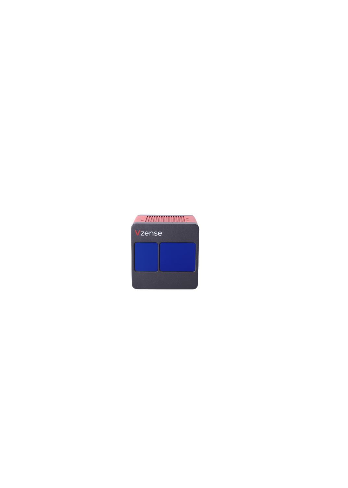 | 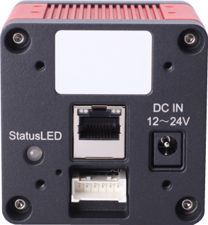 | 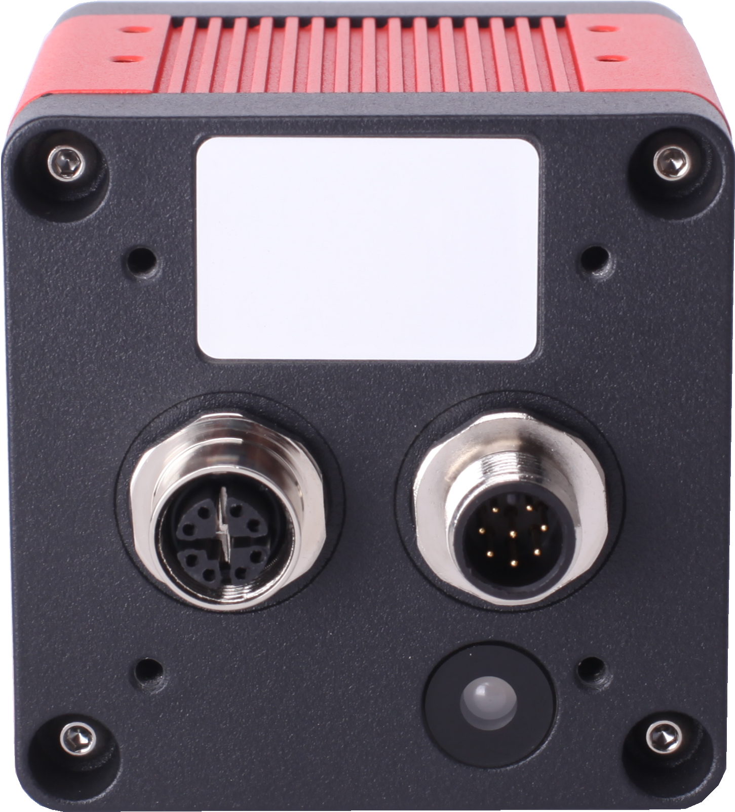 |
| ------------------------------------ | ----------------------------------------- | ---------------------------------------- |
| **Model**                            | **DS77 Lite**                             | **DS77 Pro**                             |
| **Sensor**                           | SONY DepthSense ToF                       |                                          |
| **Laser**                            | 940nm VCSEL \* 2                          |                                          |
| **TOF Resolution**                   | 640 \* 480, Max. 25fps                    |                                          |
| **TOF FOV**                          | 70°(H) \* 50°(V)                          |                                          |
| **Pixel Format**                     | 12bit Depth, 8bit IR                      |                                          |
| **Digital Interface**                | 1000M Ethernet, RS485                     |                                          |
| **Power Supply**                     | 12V \~ 24V DC                             | 12V \~ 24V DC or POE+                    |
| **Accuracy**                         | < 1% (4mm@1m)                             |                                          |
| **Detect Range**                     | 0.15m \~ 5m                               |                                          |
| **Operating Temperature**            | -20℃ \~ 50℃                               |                                          |
| **OS Support**                       | Windows, Linux, Arm Linux                 |                                          |
| **Software Support**                 | Nebula SDK, C++, C, Python                |                                          |
| **Ingress Protection**               | IP42                                      | IP67                                     |

### DS77C Lite/Pro <a href="#_toc29119" id="_toc29119"></a>

|  |  | 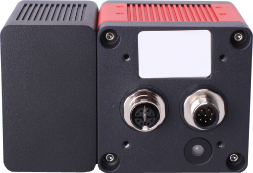 |
| ------------------------------------- | ------------------------------------------ | ----------------------------------------- |
| **Model**                             | **DS77C Lite**                             | **DS77C Pro**                             |
| **Sensor**                            | SONY DepthSense ToF + RGB                  |                                           |
| **Laser**                             | 940nm VCSEL \* 2                           |                                           |
| **TOF Resolution**                    | 640 \* 480, Max. 25fps                     |                                           |
| **RGB Resolution**                    | 1600\*1200, Max. 25fps                     |                                           |
| **TOF FOV**                           | 70°(H) \* 50°(V)                           |                                           |
| **RGB FOV**                           | 77°(H) \* 55°(V)                           |                                           |
| **Pixel Format**                      | 12bit Depth, 8bit IR, MJPEG RGB            |                                           |
| **Digital Interface**                 | 1000M Ethernet, RS485                      |                                           |
| **Power Supply**                      | 12V \~ 24V DC                              | 12V \~ 24V DC or POE+                     |
| **Accuracy**                          | < 1% (4mm@1m)                              |                                           |
| **Detect Range**                      | 0.15m \~ 5m                                |                                           |
| **Operating Temperature**             | -20℃ \~ 50℃                                |                                           |
| **OS Support**                        | Windows, Linux, Arm Linux                  |                                           |
| **Software Support**                  | Nebula SDK, C++, C, Python                 |                                           |
| **Ingress Protection**                | IP42                                       | IP67                                      |

### DS86 & DS87 <a href="#_toc24935" id="_toc24935"></a>

| 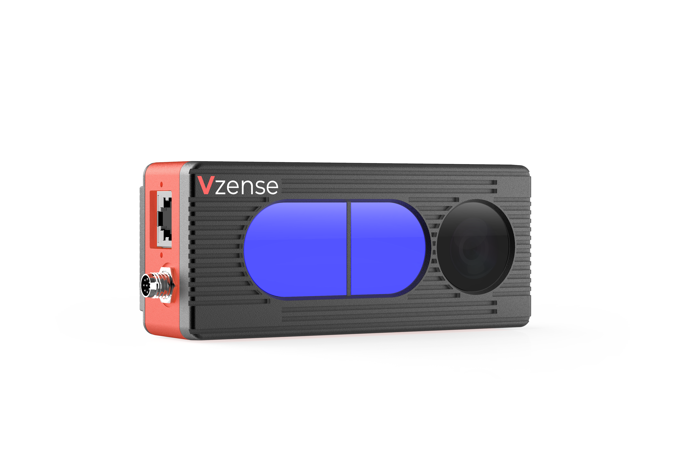   |                    | 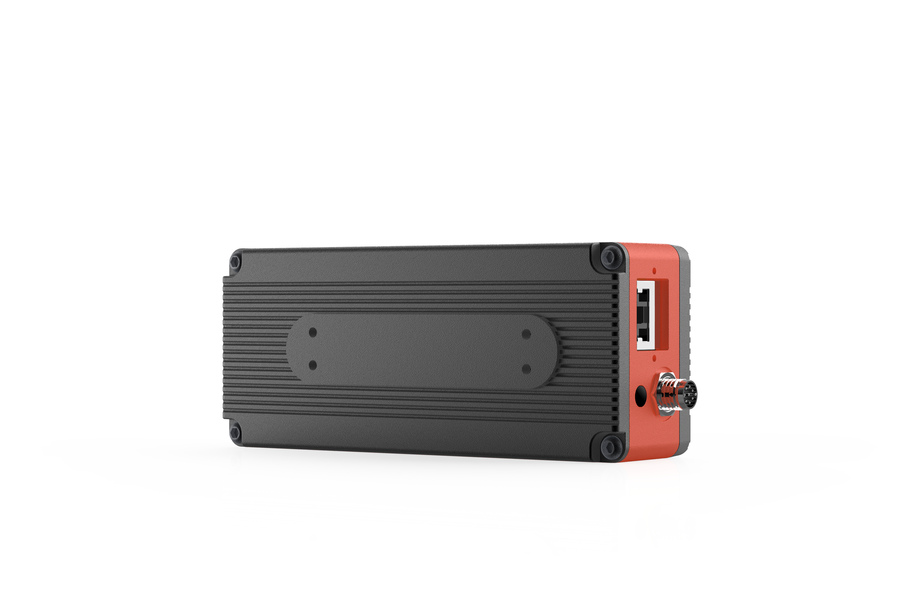            |
| ------------------------------ | ---------------------------------------------- | --------------------------------------- |
| **Model**                      | **DS87**                                       | **DS86**                                |
| **Sensor**                     | SONY DepthSense ToF CMOS                       |                                         |
| **Laser**                      | 940nm VCSEL \* 2                               |                                         |
| **TOF Resolution/Frame rate**  | 640 \* 480, Max. 15fps                         |                                         |
| **ToF HDR Mode**               | Supported with Max. 10fps                      |                                         |
| **ToF FOV**                    | 70°(H) \* 50°(V)                               |                                         |
| **RGB Camera**                 | 1600 \* 1200, , Global Shutter, 77°(H)\*55°(V) |                                         |
| **Output Format**              | RAW12(Depth, IR) + JPG(RGB)                    |                                         |
| **Interface**                  | 1000Mbps Ethernet and RS485                    |                                         |
| **Physical Connection**        | Aviation Plug x 2                              | <p>RJ45 x1</p><p>8pin Connector x 1</p> |
| **Power Supply**               | PoE+ or 12V\~24V (DC)                          | 12V\~24V (DC)                           |
| **Accuracy**                   | < 1%                                           |                                         |
| **Working Range**              | 0.15m \~ 5m                                    |                                         |
| **Working Temperature**        | -20°C to +50°C                                 |                                         |
| **Operation System\&Platform** | Windows/Linux/Arm Linux/ROS1/ROS2              |                                         |
| **SDK**                        | C/C++/Python                                   |                                         |
| **Enclosure Rating**           | IP67                                           | IP42                                    |
| **Conformity**                 | CE, FCC, FDA                                   |                                         |

### Installation <a href="#_toc29604" id="_toc29604"></a>

### Recommended Operation System <a href="#_toc4225" id="_toc4225"></a>

| **Item**         | **Recommended System**                                         |
| ---------------- | -------------------------------------------------------------- |
| Operation System | <p>Win7 32/64 bits</p><p>Win10 64 bits</p><p>Win11 64 bits</p> |

### Device Installation <a href="#_toc6557" id="_toc6557"></a>


Figure 3.1 Hardware Installation

Vzense cameras support two connection method: static IP address and DHCP. Static IP address is the default mode of Vzense devices. The IP address, subnet mask and DHCP enable also can be changed with [NebulaGUITool](https://github.com/Vzense/NebulaGUITool).

#### Static Address <a href="#_toc4061" id="_toc4061"></a>

Using static address connection method device can be connected to computer directly, or with one network switch repeat. But please ensure the camera and computer are resided on the same network segment.

For example, the direct connection: one end of the cable is connected to the camera, and the other end is plugged into RJ45 port of the PC. The default IP address of Vzense camera is 192.168.1.101, so the address of the PC can be set to 192.168.1.100. In Windows 10 system, the below picture can be referenced to set the network up.

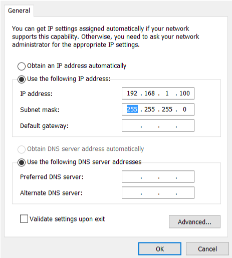

Figure 3.2 Static IP Address Configuration

#### DHCP <a href="#_toc9812" id="_toc9812"></a>

Using DHCP connection mode the Vzense camera and PC need be set to ‘DHCP’ mode, then connect them to one same LAN that have router. For details on how to set the camera to DHCP connection mode, refer to the [NebulaGUITool](https://github.com/Vzense/NebulaGUITool) documentation. Setting the ‘local connection’ of the PC to obtain the IP address automatically is the recommended method.

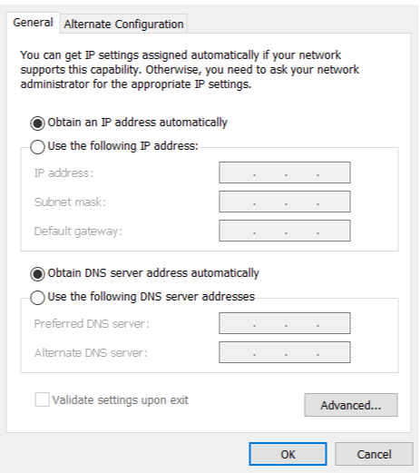

Figure 3.3 DHCP

Note:

1. The network card, router or switch all of these have to meet the requirements of 1000Mbps Ethernet.
2. When the application based on Nebula SDK first run, all options of the firewall should be chosen.

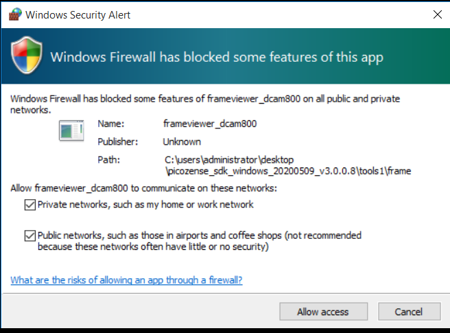

Figure 3.4 firewall setting

### Nebula SDK Instruction <a href="#_toc11641" id="_toc11641"></a>

### Nebula SDK Structure <a href="#_toc21983" id="_toc21983"></a>

In Vzense Nebula SDK, there are several directories: Bin, Document, Include, Lib, PrecompiledSamples, Samples.

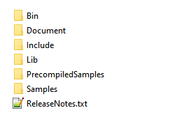

Figure 4.1 Windows Nebula SDK Directory

* Bin contains the dynamic library files of Nebula SDK.
* Document contains documents of Nebula SDK.
* Include contains header files of Nebula SDK.
* Lib contains the import library files of Nebula SDK.
* PrecompiledSamples contain several prebuild samples that can be executed directly for depth, IR and color images previewing.
* Samples contains several example codes. The examples have two different parts: Base and OpenCV. Base part is the basic APIs using example. And the other part is used to demonstrate how to use third-party library like OpenCV. In the OpenCV sample depth image, IR image and color image can be previewed using imshow method.

### Development Guidelines <a href="#_toc23054" id="_toc23054"></a>

#### Project Configuration <a href="#ole_link8" id="ole_link8"></a>

Create one new application project using Visual Studio 2017. Open the project property, insert the Include path of Nebula SDK to \[Include Directories]. The Lib path also need be added in \[Library Directories]. Additionally, it needs to add the vzenseDS\_api.lib to \[Additional Dependencies]. The project configuration in samples can be referenced.


Figure 4.2 SDK Project Configuration

#### API Invoke Flow <a href="#_toc5631" id="_toc5631"></a>

The API of Nebula SDK invoking flow chat like below:

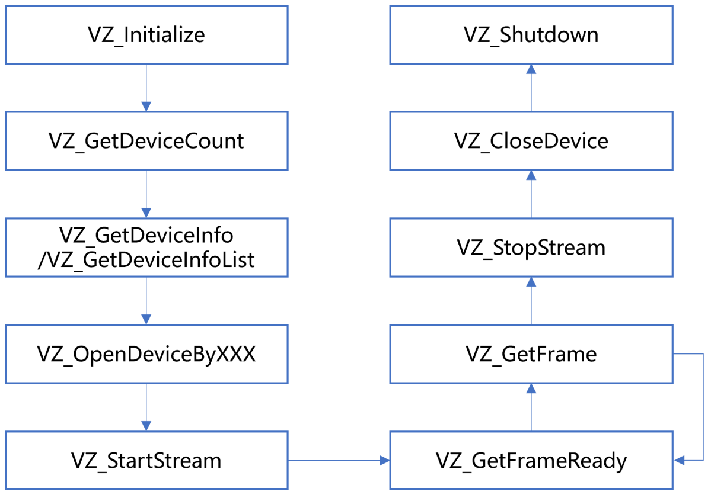

Figure 4.3 SDK API Invoke Flow Chat

1. **VZ\_Initialize and VZ\_Shutdown**

VZ\_Initialize: initialize the SDK

VZShutdown: deinitialize the SDK, and destroy all of the resources.

1. **VZ\_GetDeviceCount and VZ\_GetDeviceInfoList/VZ\_GetDeviceInfo**

VZ\_GetDeviceCount: get the number of connected devices.

VZ\_GetDeviceInfoList/VZ\_GetDeviceInfo: get the information of connected devices.

1. **VZ\_OpenDeviceByXXX and VZ\_CloseDevice**

VZ\_OpenDeviceByXXX: open the specified device, the interface can support using URI, IP Address and alias.

VZ\_CloseDevice: close the specified device.

1. **VZ\_StartStream and VZ\_StopStream**

VZ\_StatrStream: start streaming of the specified device.

VZ\_StopStream: stop streaming of the specified device.

1. **VZ\_GetFrameReady and VZ\_GetFrame**

In the main loop of capture, VZ\_GetFrameReady is called first to check the frames, then call VZ\_GetFrame to obtain the frame image data of the specified image type.

1. **Set and Get**

The SDK provides Set and Get interface for writing and reading properties, parameters of device, as detailed in Section 5.3.

### SDK Sample <a href="#_toc530821998" id="_toc530821998"></a>

Nebula software development kit provide several sample codes for API interface using demonstration in the Samples folder of the SDK. The following directories are currently available:

* Base: the basic APIs using example
* OpenCV: the example works with third-party library OpenCV

#### Base Samples <a href="#_toc28006" id="_toc28006"></a>

The base sample is used to demonstrate the single feature of basic APIs. In order to help developer familiar with SDK quickly, the examples are classified according to products, such as DS77, DS77C, etc. Open device, image acquisition, software/ hardware trigger, point cloud store are all included in the SDK example codes.

1. Download Nebula SDK from Gitee/GitHub

\> git clone [https://github.com/Vzense/NebulaSDK](https://github.com/Vzense/NebulaSDK)


Figure4.4 Download Nebula SDK

2\. Select the corresponding example according to the device. For example, the DeviceConnectByAlias example of DS77C

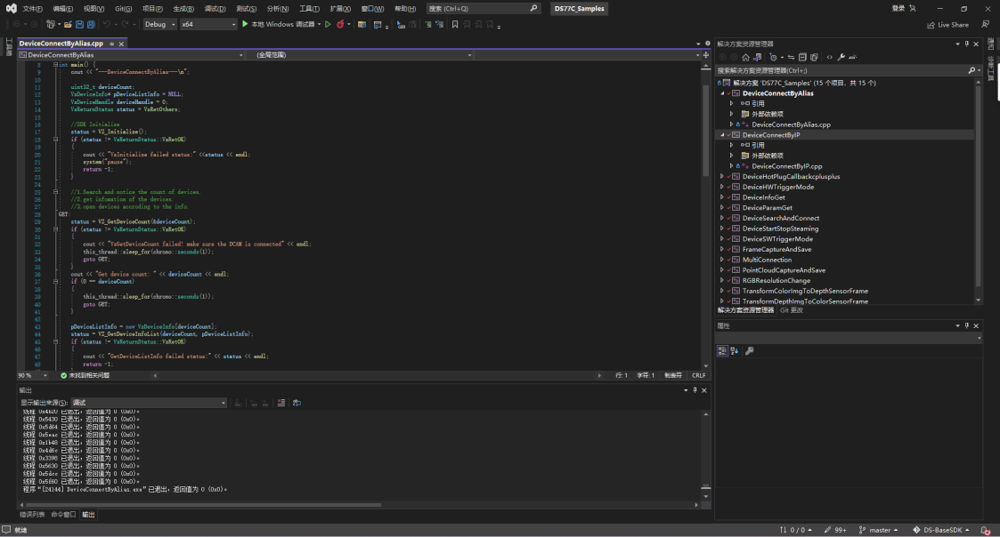

Figure 4.5 Compilation

3.After compilation, run it and check the result. The result is shown as below:

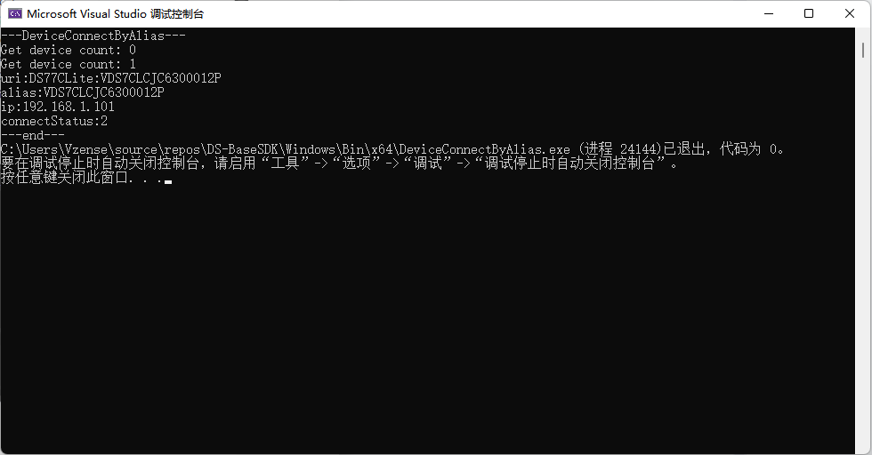

Figure 4.6 Execution

#### OpenCV Samples <a href="#_toc25810" id="_toc25810"></a>

The OpenCV samples show how to use Nebula SDK with third-party libraries. The example uses the image mapping function of OpenCV to display color depth image.

1. Download and install [OpenCV3.0.0](https://opencv.org/release/opencv-3-0-0/) from OpenCV official website. Any version could be used, it is just an example.

Figure 4.7 Download and Install OpenCV

1. Set the environment variable for OPENCV\_DIR. The variable value should be the absolute path of the directory of OpenCV, for example:

D:\Program Files\opencv-3.0.0\build.

Figure 4.8 Set the Environment Variable OPENCV\_DIR

1. Select the corresponding example according to the device, for example DS77.

Figure 4.9 FrameViewer Project

1. Build the project, the execute file is in NebulaSDK\Windows\Bin\x86 or NebulaSDK\Windows\Bin\x64.
2. Run the FrameViewer.exe, and check the result.


Figure 4.10 Execution Successful

### Nebula SDK API Introduction <a href="#_toc22323" id="_toc22323"></a>

### Enum Type <a href="#_toc27022" id="_toc27022"></a>

#### VzFrameType <a href="#_toc26502" id="_toc26502"></a>

**Description：**

Image type.

**PS**: The number of enumerated values may vary depending on the product model.

**Enumerator：**

VzDepthFrame: depth frame with 16 bits per pixel in millimeters

VzIRFrame: ir frame with 8 bits per pixel

VzColorFrame: color frame with 24 bits per pixel in RGB/BGR format

VzTransformColorImgToDepthSensorFrame: color frame with 24 bits per pixel in RGB/BGR format, that is transformed to depth sensor space where the resolution is the same as the depth frame's resolution. This frame type can be enabled VZ\_SetTransformColorImgToDepthSensorEnabled.

VzTransformDepthImgToColorSensorFrame: depth frame with 16 bits per pixel, in millimeters, that is transformed to color sensor space where the resolution is same as the color frame's resolution. This frame type can be enabled using VZ\_SetTransformDepthImgToColorSensorEnabled.

VzConfidenceFrame: Laser intensity image.

#### VzPixelFormat <a href="#_toc523" id="_toc523"></a>

**Description：**

Pixel type of image data.

PS: The number of enumerated values may vary depending on the product model.

**Enumerator：**

VzPixelFormatDepthMM16: Represents the 16-bit depth value of each pixel data in millimeters

VzPixelFormatGray8: Indicates the 8-bit grayscale value of each pixel

VzPixelFormatRGB888: Represents the 24-bit RGB value of each pixel data

VzPixelFormatBGR888: Represents the 24-bit BGR value of each pixel

#### VzSensorType <a href="#_toc14225" id="_toc14225"></a>

**Description：**

Sensor Type

PS: The number of enumerated values may vary depending on the product model.

**Enumerator：**

VzToFSensor: indicates a depth sensor

VzColorSensor: indicates a color sensor.

#### VzReturnStatus <a href="#_toc20466" id="_toc20466"></a>

**Description：**

Returns of an interface function.

PS: The number of enumerated values may vary depending on the product model. For details, see Include

**Enumerator：**

VzRetOK: indicates that the call is successful

VzRetNoDeviceConnected: indicates that no device is connected

VzRetInvalidDeviceIndex: indicates that the incoming device serial number is invalid

VzRetDevicePointerIsNull: indicates that the passed device pointer is null

VzRetInvalidFrameType: indicates that the incoming image type is invalid

VzRetFramePointerIsNull: indicates that the passed image pointer is null

VzRetNoPropertyValueGet: indicates that the current property value cannot be obtained

VzRetNoPropertyValueSet: indicates that the current property value cannot be set

VzRetPropertyPointerIsNull: said the incoming pointer to storage property value of the cache is empty

VzRetPropertySizeNotEnough: said the incoming cache space to store the value of an attribute

VzRetInvalidDepthRange: indicates that the passed depth range is invalid

Timeout while VzRetGetFrameReadyTimeOut: access to images

VzRetInputPointerIsNull: indicates that the incoming pointer is null

VzRetCameraNotOpened: indicates that the camera is not opened

VzRetInvalidCameraType: indicates that the incoming camera type is invalid

VzRetInvalidParams: indicates that the passed parameters are invalid

VzRetCurrentVersionNotSupport said the current version is not supported

VzRetUpgradeImgError: indicates that the camera firmware upgrade fails

VzRetUpgradeImgPathTooLong: said the incoming camera firmware path length is too long

VzRetUpgradeCallbackNotSet: said not set the camera to upgrade the callback function

VzRetNoAdapterConnected: indicates that the power adapter is not connected

VzRetReInitialized: indicates repeated initialization

VzRetNoInitialized: indicates that the initialization is not performed

VzRetCameraOpened: indicates that the camera is opened

VzRetCmdError: The command fails to be delivered

VzRetCmdSyncTimeOut: indicates that the command is successfully sent, but synchronization fails

VzRetIPNotMatch: indicates that the camera IP address and host IP address are on different network segments

VzRetNotStopStream: indicates that the data stream is not opened

VzRetOthers: indicates another error

#### VzConnectStatus <a href="#_toc15606" id="_toc15606"></a>

**Description：**

Device connection status.

PS: The number of enumerated values may vary depending on the product model. For details, see Include.

**Enumerator：**

VzConnectUNKNOWN: indicates that the connection status is unknown

VzUnconnected: indicates that the device is not connected

VzConnected: indicates that the device is connected

VzOpened: indicates that the device is opened

VzUpgradeUnconnected: indicates that the device is in the upgrade state

VzUpgradeConnected: indicates that the device is upgraded and connected

#### VzWorkMode <a href="#_toc16916" id="_toc16916"></a>

**Description：**

Equipment working condition.

**Enumerator：**

VzActiveMode: indicates that the device is actively working. At this point, after using API to open the camera, the device will actively upload image data.

VzHardwareTriggerMode: indicates that the device is in passive working state. At this time, after the API is used to open the camera, the device will upload the image data when the hardware triggers.

VzSoftwareTriggerMode: indicates that the device is in passive working state. At this time, after using API to open the camera, the device will upload the image data when triggered by the software.

#### VzExposureControlMode <a href="#_toc920" id="_toc920"></a>

**Description：**

Exposure mode of the sensor

**Enumerator：**

VzExposureControlMode\_Auto: indicates that the sensor uses automatic exposure mode

VzExposureControlMode\_Manual: indicates that the sensor uses manual exposure mode

### Struct Type <a href="#_toc10337" id="_toc10337"></a>

#### VzRGB888Pixel <a href="#_toc8631" id="_toc8631"></a>

**Function:**

Color image pixel type RGB888.

PS: Different models may not support RGB, for example, DCAM550. Please refer to the definition in the Include folder.

**Members:**

Uint8\_t R: indicates the red channel

Uint8\_t g: indicates the green channel

Uint8\_t b: indicates the blue channel

#### VzBGR888Pixel <a href="#_toc21396" id="_toc21396"></a>

**Function:**

Color image pixel type BGR888.

PS: Different models may not support RGB, for example, DCAM550. Please refer to the definition in the Include folder.

**Members:**

Uint8\_t b: indicates the blue channel

Uint8\_t g: indicates the green channel

Uint8\_t R: indicates the red channel

#### VzVector3f <a href="#_toc9618" id="_toc9618"></a>

**Function:**

Three dimensional point coordinates in millimeters.

**Members:**

Float x: Represents the coordinate value along the X-axis

Float y: Represents the coordinate value along the y axis

Float Z: Represents the coordinate value along the z axis

#### VzVector2u16 <a href="#_toc30026" id="_toc30026"></a>

**Function:**

Two dimensional point coordinates.

**Members:**

Float x: Represents the coordinate value along the X-axis

Float y: Represents the coordinate value along the y axis

#### VzDepthVector3 <a href="#_toc32696" id="_toc32696"></a>

**Function:**

A pixel representation of a depth image.

**Members:**

Int depthX: indicates the coordinate value along the X-axis in the image coordinate system

Int depthY: represents the coordinate value along the Y-axis in the image coordinate system

VzDepthPixel depthZ: Indicates the depth value at pixel coordinates (depthX, depthY), in millimeters

#### VzSensorIntrinsicParameters <a href="#_toc21402" id="_toc21402"></a>

**Function:**

Lens parameters and distortion parameters of the sensor. The internal parameter is usually used to calculate the point cloud and the distortion parameter is used in the image anti-distortion algorithm.

SDK has realized the function of converting depth image to point cloud and image anti-distortion, please refer to the routine to use the relevant interface.

**Members:**

Double FX: Focal length x (pixel)

Double FY: Focal length Y (pixel)

Double CX: Principal Point X (Pixel)

Double cy: Principal point Y (pixel)

Double K1: Radial distortion coefficient, 1st-order

Double K2: Radial distortion coefficient, 2nd-order

Double P1: Tangential distortion coefficient

Double P2: Tangential distortion coefficient

Double K3: Radial distortion coefficient, 3rd-order

Double K4: Radial distortion coefficient, 4ST-order

Double K5: Radial distortion coefficient, 5ND-order

Double K6: Radial distortion coefficient, 6RD-Order

#### VzSensorExtrinsicParameters <a href="#_toc7844" id="_toc7844"></a>

**Function:**

The external parameters R and T of the camera are used to align depth with RGB images. The reference formula is as follows:

**Members:**

Double rotation\[9] : A 3×3 rotation matrix

Double translation\[3] : 3×1 translation matrix

#### VzFrame <a href="#_toc18659" id="_toc18659"></a>

**Function:**

Image information

**Members:**

Uint32\_t frameIndex: indicates the image frameIndex number

VzFrameType frameType: indicates the image data type

VzPixelFormat pixelFormat: indicates the pixel type

Uint8\_t \* pFrameData: a pointer to the image data cache

Uint32\_t dataLen: Indicates the length of image data in bytes

Float exposureTime: exposureTime, in microseconds

Uint8\_t depthRange: indicates the depthRange of the current frame, valid only for depth images

Uint16\_t Width: indicates the image width

Uint16\_t height: indicates image height

Uint64\_t deviceTimestamp: represents image timestamp

#### VzFrameReady <a href="#_toc18881" id="_toc18881"></a>

**Function:**

Whether the image data is ready (1 means ready, 0 means not ready)

**Members:**

Uint32\_t Depth: 1: indicates whether the depth image data is ready

Uint32\_t IR: 1: Indicates whether grayscale image data is ready

Uint32\_t Color: 1: indicates whether color image data is ready

Uint32\_t transformedColor: 1: Indicates whether the color image aligned to the depth sensor space is ready

Uint32\_t transformedDepth: 1: indicates whether the depth image is ready to align to the color sensor space

Uint32\_t Confidence: 1: indicates whether the laser intensity image data is ready

Uint32\_t reserved: 26: : Reserved bit

#### VzDeviceInfo <a href="#_toc9034" id="_toc9034"></a>

**Function:**

Equipment information

**Members:**

Int SessionCount: indicates the number of depth sensors in the device

VzDeviceType devicetype: indicates the devicetype

Char URI \[256] : indicates the device identifier

Char alias\[64] : indicates the device alias

Char serialNumber\[64] : indicates the serialNumber of the device

Char IP \[17] : indicates the IP address of the device

VzConnectStatus Status: indicates the connection status of the device

#### VzConfidenceFilterParams <a href="#_toc12664" id="_toc12664"></a>

**Function:**

Confidence filtering parameter

**Members:**

Bool ENABLE: indicates whether filtering is enabled. True indicates that filtering is enabled. False indicates that filtering is disabled

Int threshold: indicates the filtering threshold

#### VzFlyingPixelFilterParams <a href="#_toc26879" id="_toc26879"></a>

**Function:**

To fly point filter parameters

**Members:**

Bool ENABLE: indicates whether filtering is enabled. True indicates that filtering is enabled. False indicates that filtering is disabled

Int threshold: indicates the filtering threshold

#### VzSpatialFilterParams <a href="#_toc17636" id="_toc17636"></a>

**Function:**

Spatial filtering parameters.

**Members:**

Depth indicates the reachable state of the Depth graph

Ir indicates the available state of the IR graph

RGB Indicates the available status of an RGB image

MappedRGB indicates the available status of aligned RGB images

MappedDepth indicates the available status of the Depth map after the alignment

MappedIR indicates the availability status of the IR graph after alignment

Confidence represents the accessible state of the confidence graph

WdrDepth Indicates the availability of the Depth map in WDR mode

Reserved indicates the reserved status, which is not used

#### VzFillHoleFilterParams <a href="#_toc28602" id="_toc28602"></a>

**Function:**

Parameter of hole filling filter

**Members:**

Bool ENABLE: indicates whether filtering is enabled. True indicates that filtering is enabled. False indicates that filtering is disabled

Int validCount: indicates the number of reference points used in filtering calculation

Int threshold: indicates the filtering threshold

Int doCount: indicates how many times the filtering is performed

#### VzExposureTimeParams <a href="#_toc8664" id="_toc8664"></a>

**Function:**

Sensor exposure parameter

**Members:**

VzExposureControlMode Mode: Sensor exposure type

Int exposureTime: sensor exposureTime in microseconds

### API <a href="#_toc22967" id="_toc22967"></a>

#### VZ\_Initialize <a href="#_toc6203" id="_toc6203"></a>

**Prototype:**

VzReturnStatus VZ\_Initialize()

**Description:**

To complete initialization of the SDK, you need to call it before calling other apis

**Parameters:**

There is no

**Returns:**

VzRetOK: The call is successful

Other values: Call failed

#### VZ\_Shutdown <a href="#_vz_shutdown" id="_vz_shutdown"></a>

**Prototype:**

VzReturnStatus VZ\_Shutdown()

**Description:**

The SDK is deregistered and all resources created during the SDK use are released. After this interface is called, no other interfaces other than VZ\_Initialize should be called

**Parameters:**

There is no

**Returns:**

VzRetOK: The call is successful

Other values: Call failed

#### VZ\_GetSDKVersion <a href="#_toc25280" id="_toc25280"></a>

**Prototype:**

const char\* VZ\_GetSDKVersion()

**Description:**

Obtain the SDK version: X.X.X

**Parameters:**

There is no

**Returns:**

The SDK version number

#### VZ\_GetDeviceCount <a href="#_vz_getdevicecount" id="_vz_getdevicecount"></a>

**Prototype:**

VzReturnStatus VZ\_GetDeviceCount(uint32\_t\* pDeviceCount)

**Description:**

Get the number of connected devices

**Parameters:**

Uint32\_t \* pDeviceCount: Returns the number of connected devices

**Returns:**

VzRetOK: The call is successful

Other values: Call failed

#### VZ\_GetDeviceInfo <a href="#_vz_getdeviceinfo" id="_vz_getdeviceinfo"></a>

**Prototype:**

VzReturnStatus VZ\_GetDeviceInfo(uint32\_t deviceIndex, VzDeviceInfo\* pDevicesInfo)

**Description:**

Gets information about the device with the specified index number

**Parameters:**

Uint32\_t deviceIndex: deviceIndex number

VzDeviceInfo\* pDevicesInfo: Returns device information

**Returns:**

VzRetOK: The call is successful

Other values: Call failed

#### VZ\_GetDeviceInfoList <a href="#_vz_getdeviceinfolist" id="_vz_getdeviceinfolist"></a>

**Prototype:**

VzReturnStatus VZ\_GetDeviceInfoList(uint32\_t deviceCount, VzDeviceInfo\* pDevicesInfoList)

**Description:**

Obtain the device list of the number of Devicecounts

**Parameters:**

Uint32\_t deviceCount: Number of devices that need to get the information list

VzDeviceInfo\* pDevicesInfo: Returns a list of device information that should point to a cache of size sizeof(VzDeviceInfo)\*deviceCount

**Returns:**

VzRetOK: The call is successful

Other values: Call failed

#### VZ\_OpenDeviceByUri <a href="#_toc27320" id="_toc27320"></a>

**Prototype:**

VzReturnStatus VZ\_OpenDeviceByUri(const char\* pURI, VzDeviceHandle\* pDevice)

**Description:**

Open the device using the device identifier

**Parameters:**

Const char\* pURI: indicates the device identifier

VzDeviceHandle\* pDevice: The device handle returned after successfully opening the device

**Returns:**

VzRetOK: The call is successful

Other values: Call failed

#### VZ\_OpenDeviceByAlias <a href="#_toc2783" id="_toc2783"></a>

**Prototype:**

VzReturnStatus VZ\_OpenDeviceByAlias(const char\* pAlias, VzDeviceHandle\* pDevice)

**Description:**

Open the device using the device alias

**Parameters:**

Const char\* pAlias: indicates the device alias

VzDeviceHandle\* pDevice: The device handle returned after successfully opening the device

**Returns:**

VzRetOK: The call is successful

Other values: Call failed

#### VZ\_OpenDeviceByIP <a href="#_toc32294" id="_toc32294"></a>

**Prototype:**

VzReturnStatus VZ\_OpenDeviceByIP(const char\* pIP, VzDeviceHandle\* pDevice)

**Description:**

Use the device IP address to open the device

**Parameters:**

Const char\* pIP: indicates the IP address of the device

VzDeviceHandle\* pDevice: The device handle returned after successfully opening the device

**Returns:**

VzRetOK: The call is successful

Other values: Call failed

#### VZ\_CloseDevice <a href="#_vz_closedevice" id="_vz_closedevice"></a>

**Prototype:**

VzReturnStatus VZ\_CloseDevice(VzDeviceHandle\* pDevice)

**Description:**

Close the equipment

**Parameters:**

VzDeviceHandle\* pDevice: Handle to the device to close

**Returns:**

VzRetOK: The call is successful

Other values: Call failed

#### VZ\_StartStream <a href="#_vz_startstream" id="_vz_startstream"></a>

**Prototype:**

VzReturnStatus VZ\_StartStream(VzDeviceHandle device)

**Description:**

Open data Stream

**Parameters:**

VzDeviceHandle Device: Handle to the device on which the data stream is to be closed

**Returns:**

VzRetOK: The call is successful

Other values: Call failed

#### VZ\_StopStream <a href="#_vz_stopstream" id="_vz_stopstream"></a>

**Prototype:**

VzReturnStatus VZ\_StopStream(VzDeviceHandle device)

**Description:**

Close the data stream

**Parameters:**

VzDeviceHandle Device: Handle to the device on which the data stream is to be closed

**Returns:**

VzRetOK: The call is successful

Other values: Call failed

#### VZ\_GetFrameReady <a href="#_vz_getframeready" id="_vz_getframeready"></a>

**Prototype:**

VzReturnStatus VZ\_GetFrameReady(VzDeviceHandle device, uint16\_t waitTime, VzFrameReady\* pFrameReady)

**Description:**

Gets the image ready state. This function must be called before calling VZ\_GetFrame, otherwise the image cannot be retrieved.

**Parameters:**

VzDeviceHandle Device: Device handle

Uint16\_t waitTime: Allows timeout duration (ms) for waiting for image to be ready. This value depends on the frame rate of the image. The recommended value is 2\*1000/ FPS. For example, if the current frame rate is 20, you are advised to set waitTime to 2 \* 1000/20 = 100. If set waitTime of 40, call the function might return VzRetGetFrameReadyTimeOut.

VzFrameReady\* pFrameReady: Returns the ready state of the image

**Returns:**

VzRetOK: The call is successful

Other values: Call failed

#### VZ\_GetFrame <a href="#_vz_getframe" id="_vz_getframe"></a>

**Prototype:**

VzReturnStatus VZ\_GetFrame(VzDeviceHandle device, VzFrameType frameType, VzFrame\* pVzFrame)

**Description:**

Gets image data of the specified image type. VZ\_GetFrameReady must be called before calling this function.

**Parameters:**

VzDeviceHandle Device: Device handle

VzFrameType frameType: specifies the type of the image to be obtained

VzFrame\* pVzFrame: The returned image data

**Returns:**

VzRetOK: The call is successful

Other values: Call failed

#### VZ\_SetWorkMode <a href="#_toc8525" id="_toc8525"></a>

**Prototype:**

VzReturnStatus VZ\_SetWorkMode(VzDeviceHandle device, VzWorkMode mode)

**Description:**

Set the camera working mode

**Parameters:**

VzDeviceHandle Device: Device handle

VzWorkMode mode: indicates the working mode to be set

**Returns:**

VzRetOK: The call is successful

Other values: Call failed

#### VZ\_GetWorkMode <a href="#_toc24754" id="_toc24754"></a>

**Prototype:**

VzReturnStatus VZ\_GetWorkMode(VzDeviceHandle device, VzWorkMode\* pMode)

**Description:**

Gets the working mode of the camera

**Parameters:**

VzDeviceHandle Device: Device handle

VzWorkMode\* pMode: indicates the working mode of the obtained device

**Returns:**

VzRetOK: The call is successful

Other values: Call failed

#### VZ\_SetSoftwareSlaveTrigger <a href="#_toc7801" id="_toc7801"></a>

**Prototype:**

VzReturnStatus VZ\_SetSoftwareSlaveTrigger(VzDeviceHandle device)

**Description:**

Performs a software trigger, valid only when the camera is in VzSoftwareTriggerMode

**Parameters:**

VzDeviceHandle Device: Device handle

**Returns:**

VzRetOK: The call is successful

Other values: Call failed

#### VZ\_GetSensorIntrinsicParameters <a href="#_toc24113" id="_toc24113"></a>

**Prototype:**

VzReturnStatus VZ\_GetSensorIntrinsicParameters(VzDeviceHandle device, VzSensorType sensorType, VzSensorIntrinsicParameters\* pSensorIntrinsicParameters)

**Description:**

Gets an internal parameter for the sensor lens

**Parameters:**

VzDeviceHandle Device: Device handle

VzSensorType sensorType: indicates the sensorType

VzSensorIntrinsicParameters \* pSensorIntrinsicParameters: return sensor inside the lens

**Returns:**

VzRetOK: The call is successful

Other values: Call failed

#### VZ\_GetSensorExtrinsicParameters <a href="#_toc11539" id="_toc11539"></a>

**Prototype:**

VzReturnStatus VZ\_GetSensorExtrinsicParameters(VzDeviceHandle device, VzSensorExtrinsicParameters\* pSensorExtrinsicParameters)

**Description:**

Obtain the foreign parameter of the device

**Parameters:**

VzDeviceHandle Device: Device handle

VzSensorExtrinsicParameters \* pSensorExtrinsicParameters: return outside the cords of the equipment

**Returns:**

VzRetOK: The call is successful

Other values: Call failed

#### VZ\_GetFirmwareVersion <a href="#_toc27324" id="_toc27324"></a>

**Prototype:**

VzReturnStatus VZ\_GetFirmwareVersion(VzDeviceHandle device, char\* pFirmwareVersion, int length)

**Description:**

Obtain the firmware version of the device

**Parameters:**

VzDeviceHandle Device: Device handle

Char \* pFirmwareVersion: indicates the firmware version of the device

Int length: indicates the byte length of the cache that pFirmwareVersion points to

**Returns:**

VzRetOK: The call is successful

Other values: Call failed

#### VZ\_GetDeviceMACAddress <a href="#_toc30079" id="_toc30079"></a>

**Prototype:**

VzReturnStatus VZ\_GetDeviceMACAddress(VzDeviceHandle device, char\* pMACAddress)

**Description:**

Obtain the MAC address of the device

**Parameters:**

VzDeviceHandle Device: Device handle

Char \* pMACAddress: Returns the MAC address of the device. By default, it is a string of 18 bytes ending in '\0'

**Returns:**

VzRetOK: The call is successful

Other values: Call failed

#### VZ\_SetIRGMMGain <a href="#_toc496" id="_toc496"></a>

**Prototype:**

VzReturnStatus VZ\_SetIRGMMGain(VzDeviceHandle device, uint8\_t gmmgain)

**Description:**

Set the digital gain of IR image

**Parameters:**

VzDeviceHandle Device: Device handle

Uint8\_t GMmgain: IR gain value to set to the device

**Return:**

VzRetOK: The call is successful

Other values: Call failed

#### VZ\_GetIRGMMGain <a href="#_toc11939" id="_toc11939"></a>

**Prototype:**

VzReturnStatus VZ\_GetIRGMMGain(VzDeviceHandle device, uint8\_t\* pGmmgain)

**Description:**

The digital gain of IR image is obtained

**Parameters:**

VzDeviceHandle Device: Device handle

Uint8\_t \* pGmmgain: Returns the IR gain value of the device

**Returns:**

VzRetOK: The call is successful

Other values: Call failed

#### VZ\_SetColorPixelFormat <a href="#_toc27108" id="_toc27108"></a>

**Prototype:**

VzReturnStatus VZ\_SetColorPixelFormat(VzDeviceHandle device, VzPixelFormat pixelFormat)

**Description:**

Sets the pixel format of the color image

**Parameters:**

VzDeviceHandle Device: Device handle

VzPixelFormat pixelFormat: pixelFormat for the color image to set

**Returns:**

VzRetOK: The call is successful

Other values: Call failed

#### VZ\_SetColorResolution <a href="#_toc3522" id="_toc3522"></a>

**Prototype:**

VzReturnStatus VZ\_SetColorResolution(VzDeviceHandle device, int w, int h)

**Description:**

Set the resolution of the color image

**Parameters:**

VzDeviceHandle Device: Device handle

int w: the width of color image

int h: the height of color image

**Returns:**

VzRetOK: The call is successful

Other values: Call failed

#### VZ\_GetColorResolution <a href="#_toc5175" id="_toc5175"></a>

**Prototype:**

VzReturnStatus VZ\_GetColorResolution(VzDeviceHandle device, int\* pW, int\* pH)

**Description:**

Gets the resolution of the color image

**Parameters:**

VzDeviceHandle Device: Device handle

int\* pW: Returns the width of the color image

int\* pH: Returns the height of the color image

**Returns:**

VzRetOK: The call is successful

Other values: Call failed

#### VZ\_SetFrameRate <a href="#_toc4568" id="_toc4568"></a>

**Prototype:**

VzReturnStatus VZ\_SetFrameRate(VzDeviceHandle device, int value)

**Description:**

Sets the device's image frame rate for both depth and color images. This interface is a synchronization interface, which takes about 500ms

**Parameters:**

VzDeviceHandle Device: Device handle

Int value: target frame rate to be set

**Returns:**

VzRetOK: The call is successful

Other values: Call failed

#### VZ\_GetFrameRate <a href="#_toc28775" id="_toc28775"></a>

**Prototype:**

VzReturnStatus VZ\_GetFrameRate(VzDeviceHandle device, int\* pValue)

**Description:**

Gets the image frame rate of the device

**Parameters:**

VzDeviceHandle Device: Device handle

Int \* pValue: Returns the frame rate of the device image

**Returns:**

VzRetOK: The call is successful

Other values: Call failed

#### VZ\_SetExposureControlMode <a href="#_toc28440" id="_toc28440"></a>

**Prototype:**

VzReturnStatus VZ\_SetExposureControlMode(VzDeviceHandle device, VzSensorType sensorType, VzExposureControlMode controlMode)

**Description:**

Set the exposure mode of the sensor

**Parameters:**

VzDeviceHandle Device: Device handle

VzSensorType sensorType: sensorType for which the exposure mode is to be set

VzExposureControlMode controlMode: Exposure mode to set

**Returns:**

VzRetOK: The call is successful

Other values: Call failed

#### VZ\_GetExposureControlMode <a href="#_toc472" id="_toc472"></a>

**Prototype:**

VzReturnStatus VZ\_GetExposureControlMode(VzDeviceHandle device, VzSensorType sensorType, VzExposureControlMode\* pControlMode)

**Description:**

Gets the exposure mode of the sensor

**Parameters:**

VzDeviceHandle Device: Device handle

VzSensorType sensorType: sensorType to obtain the exposure mode

VzExposureControlMode controlMode: Returns the sensor's exposure mode

**Returns:**

VzRetOK: The call is successful

Other values: Call failed

#### VZ\_SetExposureTime <a href="#_toc17228" id="_toc17228"></a>

**Prototype:**

VzReturnStatus VZ\_SetExposureTime(VzDeviceHandle device, VzSensorType sensorType, VzExposureTimeParams exposureTime)

**Description:**

Set the exposure time of the sensor

Depth sensor, only support manual exposure mode, set exposure time

Color sensor, support in automatic exposure mode, set the maximum exposure time; The exposure time can be set in manual exposure mode

**Parameters:**

VzDeviceHandle Device: Device handle

VzSensorType sensorType: sensorType to obtain the exposure time

VzExposureTimeParams exposureTime: exposureTime parameter to set

**Returns:**

VzRetOK: The call is successful

Other values: Call failed

#### VZ\_GetExposureTime <a href="#_toc24387" id="_toc24387"></a>

**Prototype:**

VzReturnStatus VZ\_GetExposureTime(VzDeviceHandle device, VzSensorType sensorType, VzExposureTimeParams\* pExposureTime)

**Description:**

Obtain the exposure time of the sensor

Depth sensor, support in manual exposure mode, access to exposure time;

The maximum exposure time can be obtained

Color sensor, support in manual exposure mode, access to exposure time;

The maximum exposure time can be obtained

**Parameters:**

VzDeviceHandle Device: Device handle

VzSensorType sensorType: sensorType to obtain the exposure time

VzExposureTimeParams\* pExposureTime: Returns the acquired exposure time parameter

**Returns:**

VzRetOK: The call is successful

Other values: Call failed

#### VZ\_SetTimeFilterEnabled <a href="#_toc16920" id="_toc16920"></a>

**Prototype:**

VzReturnStatus VZ\_SetTimeFilterEnabled(VzDeviceHandle device, bool bEnabled)

**Description:**

Set the time domain filter switch of depth image

**Parameters:**

VzDeviceHandle Device: Device handle

Bool bEnabled: True indicates that filtering is enabled. False indicates that filtering is disabled

**Returns:**

VzRetOK: The call is successful

Other values: Call failed

#### VZ\_GetTimeFilterEnabled <a href="#_toc11870" id="_toc11870"></a>

**Prototype:**

VzReturnStatus VZ\_GetTimeFilterEnabled(VzDeviceHandle device, bool \*pEnabled)

**Description:**

Obtain the time domain filter switch state of depth image

**Parameters:**

VzDeviceHandle Device: Device handle

Bool \*pEnabled: Returns filtering switch status

**Returns:**

VzRetOK: The call is successful

Other values: Call failed

#### VZ\_SetConfidenceFilterParams <a href="#_toc16496" id="_toc16496"></a>

**Prototype:**

VzReturnStatus VZ\_SetConfidenceFilterParams(VzDeviceHandle device, VzConfidenceFilterParams params)

**Description:**

Set the confidence filtering parameter of depth image

VzDeviceHandle Device: Device handle

Bool \*pEnabled: Returns filtering switch status

**Returns:**

VzRetOK: The call is successful

Other values: Call failed

#### VZ\_GetConfidenceFilterParams <a href="#_toc1529" id="_toc1529"></a>

**Prototype:**

VzReturnStatus VZ\_GetConfidenceFilterParams(VzDeviceHandle device, VzConfidenceFilterParams \*pParams)

**Description:**

The confidence filter parameters of depth image are obtained

**Parameters:**

VzDeviceHandle Device: Device handle

Bool \*pEnabled: Returns filtering switch status

**Returns:**

VzRetOK: The call is successful

Other values: Call failed

#### VZ\_SetFlyingPixelFilterParams <a href="#_toc206" id="_toc206"></a>

**Prototype:**

VzReturnStatus VZ\_SetFlyingPixelFilterParams(VzDeviceHandle device, const VzFlyingPixelFilterParams params)

**Description:**

Set the fly - point filter parameter of depth image

**Parameters:**

VzDeviceHandle Device: Device handle

Const VzFlyingPixelFilterParams params: filter parameters

**Returns:**

VzRetOK: The call is successful

Other values: Call failed

#### VZ\_GetFlyingPixelFilterParams <a href="#_toc12784" id="_toc12784"></a>

**Prototype:**

VzReturnStatus VZ\_GetFlyingPixelFilterParams(VzDeviceHandle device, VzFlyingPixelFilterParams\* params)

**Description:**

To obtain the flying point filter parameters of depth image

**Parameters:**

VzDeviceHandle Device: Device handle

VzFlyingPixelFilterParams \* params: filter parameters

**Returns:**

VzRetOK: The call is successful

Other values: Call failed

#### VZ\_SetFillHoleFilterParams <a href="#_toc28124" id="_toc28124"></a>

**Prototype:**

VzReturnStatus VZ\_SetFillHoleFilterParams(VzDeviceHandle device, const VzFillHoleFilterParams params)

**Description:**

Set the hole filling filter parameters of depth image

**Parameters:**

VzDeviceHandle Device: Device handle

Const VzFillHoleFilterParams Params: indicates the filtering parameter

**Returns:**

VzRetOK: The call is successful

Other values: Call failed

#### VZ\_GetFillHoleFilterParams <a href="#_toc28562" id="_toc28562"></a>

**Prototype:**

VzReturnStatus VZ\_GetFillHoleFilterParams(VzDeviceHandle device, VzFillHoleFilterParams\* params)

**Description:**

The hole filling filter parameters of depth image are obtained

**Parameters:**

VzDeviceHandle Device: Device handle

VzFillHoleFilterParams\* Params: indicates the obtained filtering parameter

**Returns:**

VzRetOK: The call is successful

Other values: Call failed

#### VZ\_SetSpatialFilterParams <a href="#_toc8115" id="_toc8115"></a>

**Prototype:**

VzReturnStatus VZ\_SetSpatialFilterParams(VzDeviceHandle device, const VzSpatialFilterParams params)

**Description:**

Set the spatial filtering parameters of the depth image

**Parameters:**

VzDeviceHandle Device: Device handle

Const VzSpatialFilterParams Params: indicates the filtering parameter

**Returns:**

VzRetOK: The call is successful

Other values: Call failed

#### VZ\_GetSpatialFilterParams <a href="#_toc11896" id="_toc11896"></a>

**Prototype:**

VzReturnStatus VZ\_GetSpatialFilterParams(VzDeviceHandle device, VzSpatialFilterParams\* params)

**Description:**

Set the spatial filtering parameters of the depth image

**Parameters:**

VzDeviceHandle Device: Device handle

VzSpatialFilterParams\* PARams: indicates the obtained filtering parameter

**Returns:**

VzRetOK: The call is successful

Other values: Call failed

#### VZ\_SetTransformColorImgToDepthSensorEnabled <a href="#_vz_settransformcolorimgtodepthsenso" id="_vz_settransformcolorimgtodepthsenso"></a>

**Prototype:**

VzReturnStatus VZ\_SetTransformColorImgToDepthSensorEnabled(VzDeviceHandle device, bool bEnabled)

**Description:**

Switch to set color image alignment to depth camera space. Only devices with color sensors support this operation. If turn on the switch, then call VZ\_GetFrameReady, VzFrameReady. TransformedColor value is 1, Then call VZ\_GetFrame can get VzTransformColorImgToDepthSensorFrame types of color image, the image size is the same size and depth.

**Parameters:**

VzDeviceHandle Device: Device handle

Bool bEnabled: True turns alignment on, false turns alignment off

**Returns:**

VzRetOK: The call is successful

Other values: Call failed

#### VZ\_GetTransformColorImgToDepthSensorEnabled <a href="#_toc224" id="_toc224"></a>

**Prototype:**

VzReturnStatus VZ\_GetTransformColorImgToDepthSensorEnabled(VzDeviceHandle device, bool \*bEnabled)

**Description:**

Gets the on/off state for color image alignment to depth camera space

**Parameters:**

VzDeviceHandle Device: Device handle

Bool \*bEnabled: Return switch status

**Returns:**

VzRetOK: The call is successful

Other values: Call failed

#### VZ\_SetTransformDepthImgToColorSensorEnabled <a href="#_vz_settransformdepthimgtocolorsenso" id="_vz_settransformdepthimgtocolorsenso"></a>

**Prototype:**

VzReturnStatus VZ\_SetTransformDepthImgToColorSensorEnabled(VzDeviceHandle device, bool bEnabled)

**Description:**

Switch that sets the alignment of depth images to color camera space. Only devices with color sensors support this operation. If turn on the switch, then call VZ\_GetFrameReady, VzFrameReady. TransformedDepth value is 1, Then call VZ\_GetFrame can get VzTransformDepthImgToColorSensorFrame type of depth image, its size and color image size is the same.

**Parameters:**

VzDeviceHandle Device: Device handle

Bool bEnabled: True turns alignment on, false turns alignment off

**Returns:**

VzRetOK: The call is successful

Other values: Call failed

#### VZ\_GetTransformDepthImgToColorSensorEnabled <a href="#_toc4" id="_toc4"></a>

**Prototype:**

VzReturnStatus VZ\_GetTransformDepthImgToColorSensorEnabled(VzDeviceHandle device, bool \*bEnabled)

**Description:**

Gets the on/off state of the depth image alignment to color camera space

**Parameters:**

VzDeviceHandle Device: Device handle

Bool \*bEnabled: Return switch status

**Returns:**

VzRetOK: The call is successful

Other values: Call failed

#### VZ\_TransformedDepthPointToColorPoint <a href="#_toc16747" id="_toc16747"></a>

**Prototype:**

VzReturnStatus VZ\_TransformedDepthPointToColorPoint(const VzDeviceHandle device, const VzDepthVector3 depthPoint, const VzVector2u16 colorSize, VzVector2u16\* pPointInColor)

**Description:**

Align the points on the depth image to the color image space to obtain the coordinates of the points corresponding to the passing depth image coordinate points on the color image

**Parameters:**

VzDeviceHandle Device: Device handle

Const VzDepthVector3 depthPoint: Coordinate point of the depth image

Const VzVector2u16 colorSize: Color image size

VzVector2u16\* pPointInColor: obtained color image coordinate points corresponding to the depth image coordinate points

**Returns:**

VzRetOK: The call is successful

Other values: Call failed

#### VZ\_ConvertDepthToPointCloud <a href="#_toc19462" id="_toc19462"></a>

**Prototype:**

VzReturnStatus VZ\_ConvertDepthToPointCloud(VzDeviceHandle device, VzDepthVector3\* pDepthVector, VzVector3f\* pWorldVector, int32\_t pointCount, VzSensorIntrinsicParameters\* pSensorParam)

**Description:**

The incoming depth image coordinate point set is converted to the world coordinate point set. The origin of world coordinates is in the center of the depth sensor lens, and the Z-axis is perpendicular to the front cover of the device, and its positive direction is pointing away from the device. The X-axis points to the laser from the depth lens, and its positive direction points to the distance from the device; The Y-axis is perpendicular to the device pointing to the ground, and its positive direction is pointing away from the device.

**Parameters:**

VzDeviceHandle Device: Device handle

VzDepthVector3\* pDepthVector: A collection of coordinate points of the depth image

VzVector3f\* pWorldVector: The set of coordinate points of the transformed point cloud

Int32\_t pointCount: indicates the number of coordinate points

VzSensorIntrinsicParameters \* pSensorParam: sensor inside

**Returns:**

VzRetOK: The call is successful

Other values: Call failed

#### VZ\_ConvertDepthFrameToPointCloudVector <a href="#_toc21361" id="_toc21361"></a>

**Prototype:**

VzReturnStatus VZ\_ConvertDepthFrameToPointCloudVector(VzDeviceHandle device, const VzFrame\* pDepthFrame, VzVector3f\* pWorldVector)

**Description:**

Convert the depth image to a set of world frame points. The size of the converted world frame points is vzframe.width \* vzframe.height, Support VzDepthFrame and VzTransformDepthImgToColorSensorFrame images

**Parameters:**

VzDeviceHandle Device: Device handle

Const VzFrame\* pDepthFrame: Depth image

VzVector3f\* pWorldVector: The set of coordinate points of the transformed point cloud

**Returns:**

VzRetOK: The call is successful

Other values: Call failed

#### VZ\_SetHotPlugStatusCallback <a href="#_toc19564" id="_toc19564"></a>

**Prototype:**

VzReturnStatus VZ\_SetHotPlugStatusCallback(PtrHotPlugStatusCallback pCallback, const void\* pUserData)

**Description:**

Example Set the callback function for hot swap status

**Parameters:**

PtrHotPlugStatusCallback pCallback: indicates the callback function

Const void\* pUserData: user data; may be empty

**Returns:**

VzRetOK: The call is successful

Other values: Call failed

### FAQ <a href="#_toc25851" id="_toc25851"></a>

### Where is SDK log stored？ <a href="#_toc15675" id="_toc15675"></a>

For Windows, default location: C:\Users\\\<user name>\AppData\Local\Vzense\Log

### Nebula SDK cannot search the camera <a href="#_toc2401" id="_toc2401"></a>

Following lists need to be checked if Ethernet access cameras can’t be searched.

1. Make sure good connection between the DUT and the host, and confirm if the network adapter of the host works well.
2. Make sure the DUT is under the same LAN as the host. If the DUT is set in non-DHCP mode, make sure the DUT’s fixed IP is in the same internet segment as the host, like 192.168.1.X; If the DUT is set in DHCP mode, make sure the DUT is in the same LAN as the host, and the router/switch has DHCP server function.
3. Make sure the software’s internet permission is not prohibited.
4. Make sure Internet UDP function is not prohibited by LAN safety policy.
5. Make sure LAN 9007, 9008, 9009 port is not prohibited
6. Make sure power supply is correct. If not POE approach, make sure power adapter is plugged.

If the above check items are OK, but the camera still cannot be opened, please contact FAE。

Email: info@vzense.com
